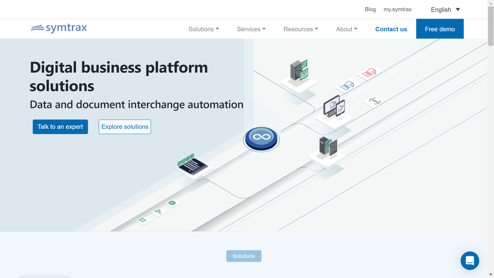

# Symtrax

Symtrax provides document management and output management solutions that help organizations automate document workflows, enhance document processing, and optimize business communications.

## Overview

Symtrax specializes in document management, output management, and business process automation solutions that help organizations optimize their document-centric workflows. The company offers a suite of software products designed to capture, process, distribute, and archive business documents efficiently across enterprise environments.

Founded with a focus on practical business applications, Symtrax has developed solutions that address document management challenges across multiple industries. Their technology enables organizations to handle both digital and physical documents, supporting digital transformation initiatives while maintaining compatibility with legacy systems and processes.

Symtrax serves organizations across various sectors, including manufacturing, distribution, retail, and financial services. Their solutions help organizations reduce manual document handling, improve data accessibility, enhance document security, and ensure regulatory compliance while optimizing operational efficiency.

## Key Features

- **Document Capture**: Multi-channel document acquisition capabilities
- **Output Management**: Control and optimization of document output processes
- **Document Distribution**: Automated routing and delivery of documents
- **Format Conversion**: Transformation between various document formats
- **Data Extraction**: Retrieval of information from business documents
- **Workflow Automation**: Streamlined document-centric processes
- **Archive Management**: Secure document storage and retrieval
- **System Integration**: Connections with ERP and business applications
- **Compliance Support**: Features to maintain regulatory requirements
- **Reporting and Analytics**: Insights into document processing operations

## Use Cases

### ERP Document Management

Organizations implement Symtrax solutions to enhance document management capabilities within their ERP environments. The software captures documents generated by enterprise systems, applying consistent formatting, branding, and distribution rules based on document type and content. The system automatically distributes documents to appropriate recipients through preferred channels (email, print, fax, web) while maintaining comprehensive archives for audit and retrieval purposes. Business rules determine document routing, approval workflows, and retention policies to ensure compliance with organizational and regulatory requirements. This approach reduces document processing costs, improves delivery reliability, enhances document accessibility, and strengthens compliance capabilities through consistent application of document management policies.

### Accounts Payable and Receivable Automation

Financial departments utilize Symtrax technology to streamline accounts payable and receivable processes. The solution captures financial documents such as invoices and statements from multiple sources, extracts relevant data, and integrates with accounting systems to facilitate processing. For accounts payable, the system matches invoices with purchase orders and receiving documents, routing exceptions through appropriate approval workflows. For accounts receivable, the platform generates customer statements and payment reminders according to predefined schedules and business rules. Digital archiving maintains searchable records for audit and inquiry purposes. This implementation accelerates financial document processing, improves accuracy through automation, enhances visibility into financial operations, and strengthens vendor and customer relationships through more reliable document handling.

## Technical Specifications

| Feature | Specification |
|---------|---------------|
| Key Products | Compleo Suite, StarQuery, DataPA |
| ERP Compatibility | SAP, Oracle, Microsoft Dynamics, Infor |
| Deployment Options | Cloud, On-premises, Hybrid |
| Document Formats | All major formats (PDF, Office, XML, EDI, etc.) |
| Integration Methods | APIs, Connectors, Direct Database Access |
| Operating Systems | Windows, Linux, IBM i, AIX |
| Implementation Approach | Professional services and partner network |
| Scalability | Enterprise-grade for high-volume environments |
| Security Features | Role-based access, encryption, audit trails |
| Compliance Support | GDPR, SOX, HIPAA, industry-specific standards |

## Getting Started

1. **Process Assessment**: Evaluation of current document workflows and systems
2. **Solution Design**: Configuration based on organizational requirements
3. **Implementation**: Deployment and integration with existing systems
4. **User Training**: Enablement for administrators and end users
5. **Ongoing Support**: Maintenance and continuous improvement

## Resources

- [Company Website](https://www.symtrax.com/)
