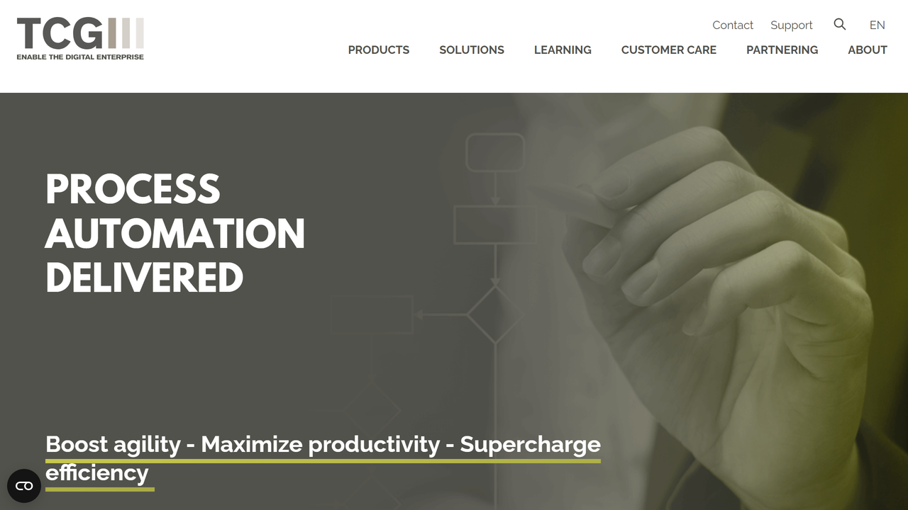

# TCG Process

TCG Process provides intelligent document processing and business process automation solutions that help organizations transform document-centric workflows through AI-powered technologies.

## Overview

TCG Process specializes in developing and implementing intelligent automation solutions for document processing and business workflows. The company's flagship platform, DocProStar, combines various technologies including OCR, machine learning, and process automation to create comprehensive solutions for handling document-intensive processes.

Founded in Germany and now operating globally, TCG Process has established itself as a provider of enterprise-grade document processing solutions that balance technological innovation with practical business application. Their approach focuses on creating flexible, adaptable systems that can handle complex document types and variable processing requirements.

TCG Process serves clients across multiple industries including financial services, insurance, healthcare, and public sector organizations. Their solutions help these organizations reduce manual processing effort, improve data accuracy, accelerate document workflows, and enhance overall operational efficiency.

## Key Features

- **Intelligent Document Processing**: Advanced capture and extraction from various document types
- **Cognitive Classification**: AI-powered document categorization and routing
- **Machine Learning Models**: Self-improving extraction accuracy through ML
- **Process Automation**: End-to-end workflow orchestration for document processing
- **Decision Management**: Rule-based processing with exception handling
- **Data Validation**: Automated verification of extracted information
- **Integration Framework**: Connectivity with enterprise systems and repositories
- **Multi-Channel Input**: Support for various document input methods and formats
- **User Interface**: Intuitive interfaces for configuration and exception handling
- **Analytics and Reporting**: Insights into process performance and bottlenecks

## Use Cases

### Insurance Claims Processing

Insurance companies implement TCG Process solutions to streamline claims processing workflows. The platform captures incoming claims documents through multiple channels, automatically classifies them by type, extracts relevant information like policy numbers, claim details, and damage assessments, and routes them through appropriate approval workflows. Built-in validation checks verify the extracted data against policy databases while machine learning continuously improves extraction accuracy for complex forms. Integration with claims management systems enables straight-through processing for routine claims while identifying exceptions that require human review. This comprehensive approach reduces claims processing time by up to 70%, improves data accuracy to over 95%, enables consistent application of claims rules, and provides real-time visibility into claims status for both processors and customers.

## Resources

- [Company Website](https://www.tcgprocess.com/en-en/)
