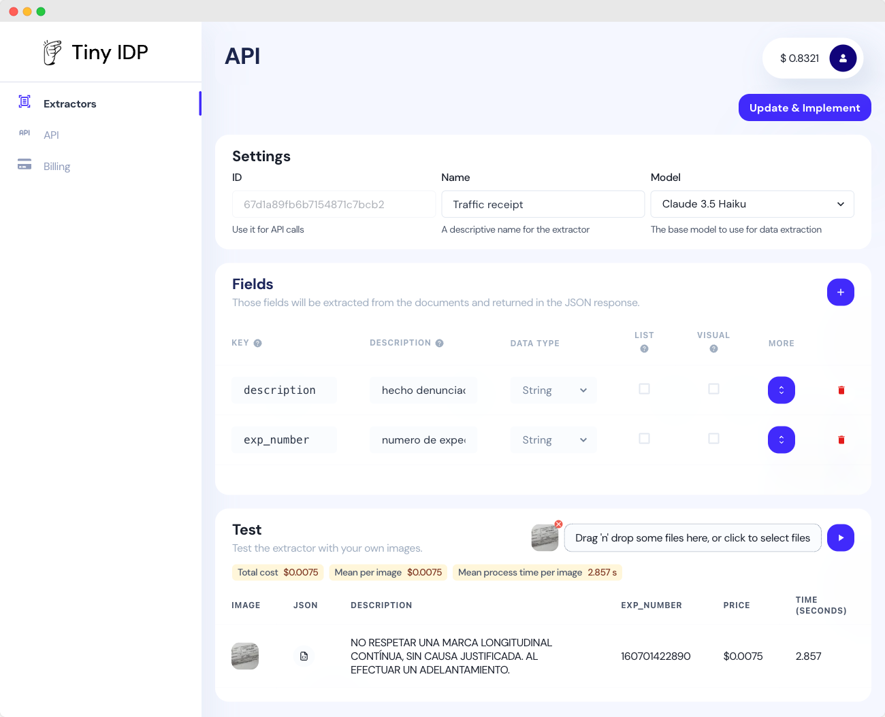

# Tiny IDP

Tiny IDP is a modern, LLM-powered document data extraction API that converts documents into structured JSON data in seconds.

<iframe width="560" height="315" src="https://www.youtube.com/embed/8Pv-bEy22ys?si=rthwvzV2VM9jFcy2" title="YouTube video player" frameborder="0" allow="accelerometer; autoplay; clipboard-write; encrypted-media; gyroscope; picture-in-picture; web-share" referrerpolicy="strict-origin-when-cross-origin" allowfullscreen></iframe>

## Overview

Tiny IDP leverages advanced Large Language Models (LLMs) like Claude Sonnet 3.7 and GPT-4o to extract custom data from any document or image. Unlike traditional OCR solutions, Tiny IDP offers intelligent extraction that understands document context and semantics, making it more accurate and versatile for various document types.

## Key Features

- **LLM-Powered Extraction**: Uses the latest AI models for intelligent document understanding
- **Custom JSON Output**: Extracts data into structured, customizable JSON format
- **Superior OCR Capabilities**: Better text recognition than standard OCR solutions
- **Fast Processing**: Converts documents to structured data in seconds
- **Support for Various Document Types**: Works with images, PDFs, and other document formats
- **API Integration**: Easy to integrate into existing workflows

## Use Cases

### Invoice Processing

Tiny IDP can extract relevant information from invoices including:
- Invoice numbers and dates
- Vendor information
- Line items and amounts
- Tax calculations
- Payment terms

### Contract Analysis

Extract and structure key information from long contracts (+50 pages) such as:
- Party information
- Contract terms and conditions
- Key dates and deadlines
- Special clauses
- Obligations and rights

### Receipt Processing

Accurately extract data from receipts including:
- Merchant information
- Transaction date and time
- Items purchased
- Prices and totals
- Payment method

### Handwritten Form Processing

Process various handwritten forms to extract:
- Personal information
- Application details
- Selections and choices
- Signatures and dates

## Technical Specifications

| Feature | Specification |
|---------|---------------|
| Deployment | Cloud API |
| Integration | REST API with JSON responses |
| Input Formats | PDF, JPEG, PNG, TIFF, and more |
| Output Format | Custom JSON |
| Processing Speed | Seconds per document |
| Accuracy | Superior to traditional OCR |
| Security | Secure data handling |

## Getting Started

To start using Tiny IDP:

1. Sign up at [tiny-idp.com](https://tiny-idp.com)
2. Create an extractor for your document type (define properties, their type, etc.)
3. Test the extractor with your documents and our different models to test speed and accuracy
4. Get your API key
5. Send documents via the API, to the extractor you created.
4. Receive structured JSON data

## Resources

- [Website](https://tiny-idp.com)
- [Blog](https://medium.com/@tinyidp)
- [Pricing](https://tiny-idp.com/#pricing)

## Contact Information

- Website: [tiny-idp.com](https://tiny-idp.com)
- Email: info@tiny-idp.com
