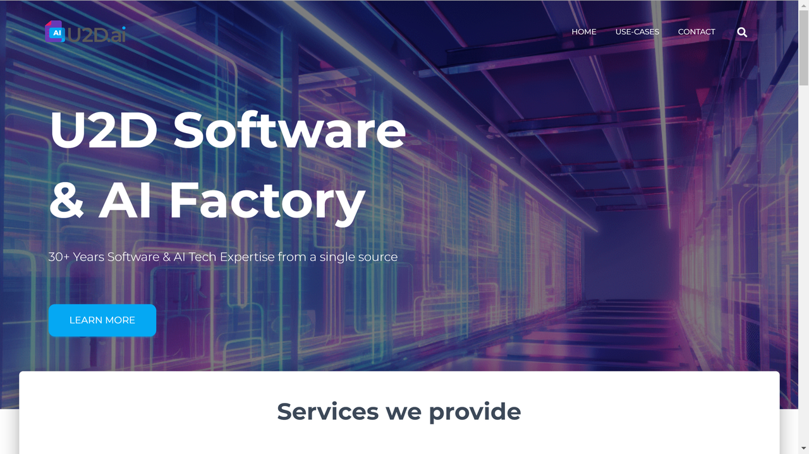

# U2D.ai

[U2D.ai](https://web.archive.org/web/20240728063247/https://www.u2d.ai/) was until 2024 a German technology company specializing in AI-powered document management and intelligent processing solutions that help organizations automate document workflows and extract valuable insights from their content.

## Overview

U2D.ai offers advanced document intelligence solutions designed to transform how organizations manage, process, and leverage their document-based information. Their platform combines artificial intelligence, machine learning, and natural language processing to automate document-centric tasks and workflows.

Based in Berlin, Germany, U2D.ai has established itself as an innovative provider of AI microservices and document intelligence solutions. Their technology is distinguished by its focus on practical applications of AI for document processing, including classification, data extraction, and translation services [[1]](https://www.crunchbase.com/organization/u2d-ai). The company leverages cutting-edge AI technologies to create solutions that address specific document management challenges faced by businesses across various industries.

U2D.ai serves organizations looking to optimize their document-intensive processes, improve data extraction accuracy, and enhance decision-making through better information management. Their platform is particularly valuable for businesses with high volumes of documents requiring consistent processing and data extraction, such as financial services, legal, healthcare, and government entities.

## Key Features

- **Intelligent Document Processing**: AI-powered extraction of structured data from documents
- **Document Classification**: Automated categorization of documents by type and content
- **Data Extraction**: Identification and capture of key information from documents
- **Document Translation**: AI-assisted translation of document content
- **Workflow Automation**: Streamlined document routing and processing
- **Learning Management**: Integration with the Aprenia learning platform
- **AI Microservices**: Modular AI capabilities for custom implementations
- **Document Analysis**: Advanced content understanding and insights
- **Integration Capabilities**: Connections with existing enterprise systems
- **Document Intelligence**: Enhanced decision support through document analysis

## Use Cases

### Automated Document Processing

Organizations implement U2D.ai's platform to streamline the handling of large volumes of incoming documents. The system automatically classifies various document types including invoices, contracts, forms, and correspondence based on their structure and content. Intelligent OCR capabilities extract relevant data fields with high accuracy, even from complex or variable layouts. Machine learning models continuously improve extraction accuracy by learning from corrections and new document samples. Extracted data is validated against business rules and existing systems before being routed to appropriate workflows or enterprise applications. This implementation reduces manual data entry by automating extraction processes, improves processing speed through intelligent document routing, enhances data accuracy through consistent extraction methodology, and creates cost savings through reduced handling time and error rates.

### Knowledge Management and Learning

Educational institutions and corporate training departments utilize U2D.ai's technology to enhance their knowledge management systems and learning platforms. The solution automatically processes and organizes educational content including textbooks, research papers, presentations, and multimedia resources. AI-powered content analysis extracts key concepts, terminology, and relationships to create rich metadata for improved searchability. Integration with U2D's Aprenia learning platform enables personalized learning paths based on content analysis and user behavior. Natural language processing capabilities support question answering and content summarization features. This approach enhances learning experiences through intelligent content organization, improves knowledge discovery through concept-based search capabilities, enables personalized learning through content recommendations, and facilitates content reuse through automated tagging and categorization.

### Multilingual Document Intelligence

International organizations leverage U2D.ai's capabilities to manage and extract value from multilingual document collections. The platform processes documents in multiple languages with language-specific OCR and text analysis. AI-powered translation services convert document content while preserving formatting and context. Cross-lingual search functionality enables users to find information regardless of the original document language. Semantic analysis works across languages to identify similar concepts and topics in diverse document sets. This implementation supports global operations through consistent multilingual document processing, enhances collaboration across language barriers through automated translation, improves compliance through comprehensive multilingual information governance, and increases information accessibility through cross-lingual search and discovery.

## Technical Specifications

| Feature | Specification |
|---------|---------------|
| AI Technologies | Natural Language Processing, Machine Learning, OCR |
| Document Types | Structured, semi-structured, unstructured documents |
| Language Support | Multiple languages including German, English, French |
| Deployment Options | Cloud, on-premises, hybrid |
| Integration Methods | APIs, connectors, custom development |
| Data Extraction Accuracy | Continuously improving with machine learning |
| Processing Capacity | Scalable to high-volume document processing |
| Security | Data encryption, access controls, compliance features |
| Output Formats | Structured data, JSON, XML, database integration |
| Analytics | Document processing metrics, extraction quality tracking |

## Getting Started

1. **Assessment**: Evaluation of document processing requirements
2. **Solution Design**: Configuration based on specific document types
3. **Implementation**: Deployment and integration with existing systems
4. **Training**: Model training with organization-specific documents
5. **Optimization**: Continuous improvement of processing accuracy

## Resources

- [Company Profile](https://www.crunchbase.com/organization/u2d-ai)
- [Knowledge Management Blog](https://u2d.de/en/blog/knowledge-management-2024-essential-trends)
