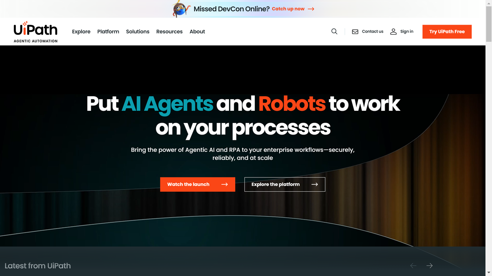

# UiPath

UiPath founded in 205 started to provide RPA automation, published Document Understanding and now migrates it to Generative Extraction on UiPath® IXP.

## News

- On May 22, 2025 UiPath launched [Generative Extraction on UiPath® IXP](https://docs.uipath.com/document-understanding/automation-cloud/latest/USER-GUIDE/document-understanding-migration-to-uipath-ixp) and 
at the same time [deprecated the integration](https://docs.uipath.com/overview/other/latest/overview/deprecation-timeline#deprecated-features-or-capabilities) to [Abbyy](../abbyy/index.md).

## Overview

UiPath provides an end-to-end automation platform that includes document understanding and processing capabilities. Their technology allows organizations to extract and process data from various document types, helping automate document-centric workflows and integrate document data with other business processes and systems.

## Key Features

- Robotic Process Automation (RPA)
- AI-powered document understanding
- Machine learning for document classification
- Automated data extraction
- Process mining and task mining
- Test automation
- Process automation cloud
- Workflow automation

## Use Cases

- Invoice processing automation
- Purchase order processing
- Contract analysis
- Form processing
- Customer onboarding
- Loan application processing
- Claims processing
- HR document processing

## Technical Specifications

UiPath's Document Understanding framework combines OCR, computer vision, and machine learning to extract data from various document types. The platform offers both cloud-based and on-premises deployment options, with enterprise-grade security features and scalability. It can be integrated with existing enterprise systems and supports various document formats.

## Resources

- [Website](https://www.uipath.com)
- [Documentation](https://docs.uipath.com/document-understanding)
