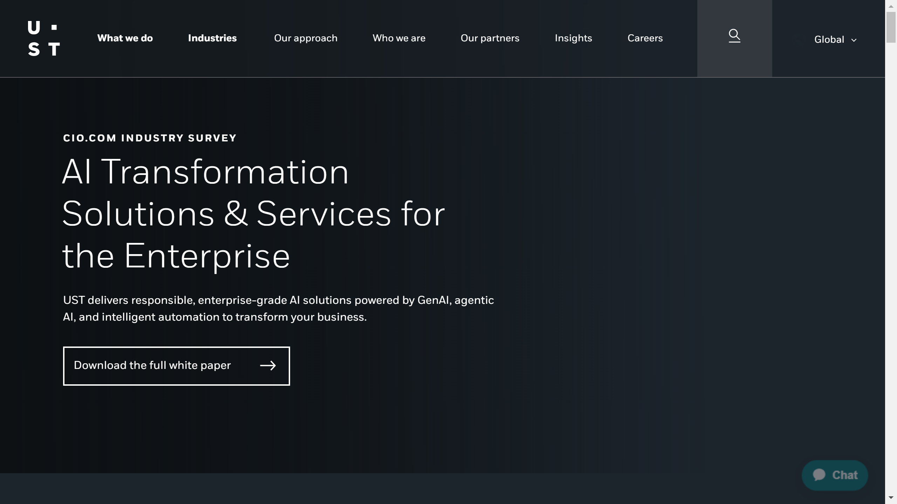

# UST

UST is a company that specializes in intelligent document processing and digital transformation solutions. The company focuses on creating intelligent automation for document workflows.

## Overview

UST provides intelligent document processing and digital transformation solutions designed to create intelligent automation for document workflows. Their platform focuses on leveraging advanced technology to transform, process, and manage documents across enterprise environments.

## Key Features

- Intelligent document processing
- Digital transformation solutions
- Document workflow automation
- Intelligent automation platform
- Digital transformation tools
- Document processing automation
- Intelligent data handling

## Use Cases

- Intelligent document processing
- Digital transformation automation
- Document workflow optimization
- Intelligent automation implementation
- Document processing workflows
- Digital transformation optimization
- Intelligent document workflows

## Technical Specifications

UST's platform specializes in intelligent document processing and digital transformation solutions, creating intelligent automation for document workflows that leverage advanced technology to transform and process documents efficiently.

## Company Information

Aliso Viejo, United States

Web: [https://www.ust.com](https://www.ust.com/) 