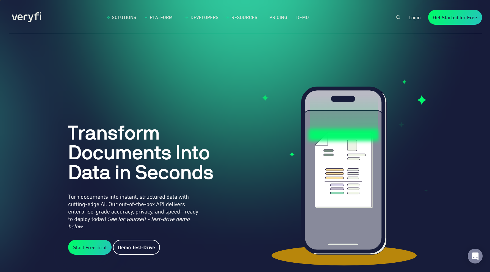

# Veryfi
AI-powered document processing platform specializing in receipt and expense data extraction with mobile capture capabilities.

## Overview

Veryfi is an intelligent document processing (IDP) software company founded in 2017 and launched from the Y Combinator startup incubator in Silicon Valley. The company began as a personal expense app to help small business owners manage receipts, driven by the founders' personal experience with their mothers who worked as bookkeepers. Today, Veryfi has evolved into a comprehensive IDP platform with 52 full-time employees and $12.7 million in Series A funding raised in 2021.

The company's core mission is "Liberating the world from data entry" by automating the tedious process of manual data extraction from purchasing documents. While positioning itself as a general-purpose IDP platform, Veryfi's primary strength lies in spend management and expense reporting use cases. The company serves as an OEM provider to several top spend management software companies and has expanded into loyalty marketing programs, landing major clients including a top-three global food and beverage company and a top-five consumer packaged goods brand marketing agency.

Veryfi's competitive advantage stems from its extensive training data collected from years of receipt processing, giving it superior AI models compared to competitors who struggle to find sufficient valid training data for their systems.

## Key Features

- **No-Template AI Processing**: Uses advanced AI models for data extraction without requiring pre-built templates, powered by natural language processing (NLP) and optical character recognition (OCR)
- **Graph Neural Networks**: Employs graph neural networks (GNN) to understand document relationships and remove semantic ambiguity in data extraction
- **Mobile Capture Framework**: Veryfi Lens provides state-of-the-art mobile capture with auto document detection, edge detection, and long receipt mode for stitching multiple scans
- **Line-Item Extraction**: Capable of extracting detailed line-item information from receipts and invoices with high accuracy
- **Data Enrichment**: Applies classification and enhancement techniques to deliver standardized JSON output ready for business application consumption

## Use Cases

### Expense Management and Reporting
Veryfi excels at processing receipts for expense management systems, providing seamless integration with spend management platforms. The solution eliminates manual data entry by automatically extracting vendor information, amounts, dates, and line items from receipt images captured via mobile devices.

### Accounts Payable Invoice Processing
The platform processes invoices for accounts payable automation, leveraging its AI models to extract key invoice data including vendor details, amounts, dates, and purchase order information for integration with ERP systems.

### Loyalty Marketing Programs
Veryfi has expanded into loyalty program data extraction, helping major brands capture purchase data from receipts to drive customer engagement and marketing campaigns.

### Small Business Bookkeeping
Originally designed for small business owners, Veryfi continues to serve this market by automating the data entry process for bookkeeping and accounting software integration.

## Technical Specifications

| Feature | Specification |
|---------|---------------|
| Deployment Options | Cloud-native API service |
| API | RESTful OCR API Platform |
| Supported Languages | Multiple languages supported via NLP |
| Document Formats | Mobile images, email attachments, PDF, various image formats |
| Mobile Framework | Veryfi Lens Mobile Capture Framework |
| AI Technology | Convolutional Neural Networks (CNN), Graph Neural Networks (GNN) |
| Output Format | Standardized JSON |
| Human-in-the-Loop | No outsourced human verification required |

## Getting Started

To get started with Veryfi, businesses can access the OCR API Platform through their cloud-native service. The platform accepts documents through multiple channels including mobile capture via the Veryfi Lens framework, email attachments, or direct API integration.

For mobile capture, developers can implement the Veryfi Lens Mobile Capture Framework, which provides advanced computer vision capabilities including automatic document detection and edge detection for optimal image capture quality.

## Resources

- [Veryfi Website](https://veryfi.com)
- [API Documentation](https://veryfi.com/api)
- [Developer Resources](https://veryfi.com/developers)
- [Venfor profile of Verify created by Deep Analysis](https://web.archive.org/web/20250728185257/https://14567012.fs1.hubspotusercontent-na1.net/hubfs/14567012/Deep%20Analysis%20-%20Veryfi%20Vendor%20Vignette.pdf.pdf) - Independent analysis of Veryfi's IDP capabilities

## Contact Information

- Website: [veryfi.com](https://veryfi.com)
- Headquarters: San Mateo, CA
- Founded: 2017
- Employees: 52 (as of March 2023)
