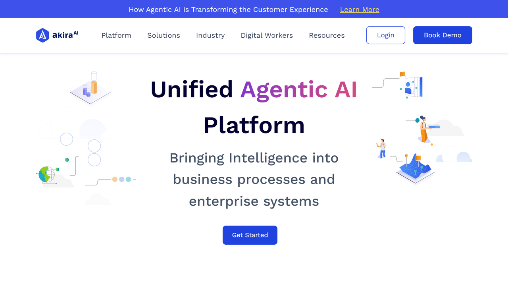

# XenonStack / Akira.ai

XenonStack is a technology company that offers Akira.ai, an intelligent document processing platform that leverages artificial intelligence to automate document analysis, data extraction, and workflow automation.

## Overview

XenonStack develops Akira.ai, an AI-powered document intelligence platform designed to help organizations transform their document-centric processes through intelligent automation. Akira.ai combines various AI technologies including computer vision, natural language processing, and machine learning to understand, extract, and process information from different document types.

As a product developed by XenonStack, Akira.ai benefits from the company's broader expertise in artificial intelligence, cloud computing, and enterprise software development. The platform is designed to be both powerful and accessible, enabling organizations to implement document automation without extensive technical expertise.

Akira.ai addresses document processing challenges across industries, with particular focus on financial services, healthcare, legal, and enterprise operations. The solution helps organizations reduce manual document handling, improve data accuracy, accelerate processing times, and gain insights from document-based information.

## Key Features

- **Intelligent Document Processing**: AI-powered analysis and data extraction from various document types
- **Document Classification**: Automated categorization of documents by type and content
- **Data Extraction**: Structured data capture from unstructured and semi-structured documents
- **Contextual Understanding**: Comprehension of document semantics and relationships
- **Workflow Automation**: End-to-end process automation for document-centric workflows
- **Integration Capabilities**: Connections with existing business systems and repositories
- **Quality Assurance**: Validation mechanisms and confidence scoring for extracted data
- **Analytics and Insights**: Document intelligence and process performance metrics
- **Custom Model Development**: Tailored AI models for specific document types
- **Multi-Channel Input**: Support for various document capture methods and formats

## Use Cases

### Financial Document Processing

Financial institutions implement Akira.ai to automate the processing of financial documents such as loan applications, account statements, and KYC documents. The platform captures incoming documents from multiple channels, automatically classifies them by type, extracts relevant financial data, and validates information against business rules and existing data. This automation reduces manual processing time, improves data accuracy, and accelerates financial workflows, ultimately enhancing customer experience through faster service delivery.

### Contract Analysis and Management

Organizations use Akira.ai to streamline contract management processes. The solution automatically extracts key information from contracts including parties, terms, obligations, and clauses, organizing this data for easy access and analysis. The platform identifies important contractual elements, flags potential risks, and tracks critical dates for renewals or obligations. This capability helps legal and procurement teams manage contracts more effectively, reduce risk exposure, and ensure compliance with contractual terms.

## Technical Specifications

| Feature | Specification |
|---------|---------------|
| Deployment Options | Cloud, On-Premise, Hybrid |
| Integration Methods | REST APIs, Webhooks, SDK |
| Supported Formats | PDF, TIFF, JPEG, PNG, Office Formats |
| AI Technologies | Computer Vision, NLP, Machine Learning |
| Processing Capability | High-volume document processing |
| Language Support | Multi-language document processing |
| Security Features | Encryption, access controls, audit logs |
| Scalability | Enterprise-grade performance |
| Accuracy Metrics | Confidence scoring and validation |
| Customization | Configurable for specific document types |

## Getting Started

1. **Use Case Assessment**: Identify document-centric processes for automation
2. **Solution Design**: Configure the platform for specific document types
3. **Integration Planning**: Determine connection points with existing systems
4. **Implementation**: Deploy and test the solution
5. **Continuous Improvement**: Refine models and workflows based on results

## Resources

- [Company Website](https://www.akira.ai/)
- [XenonStack Website](https://www.xenonstack.com/)
