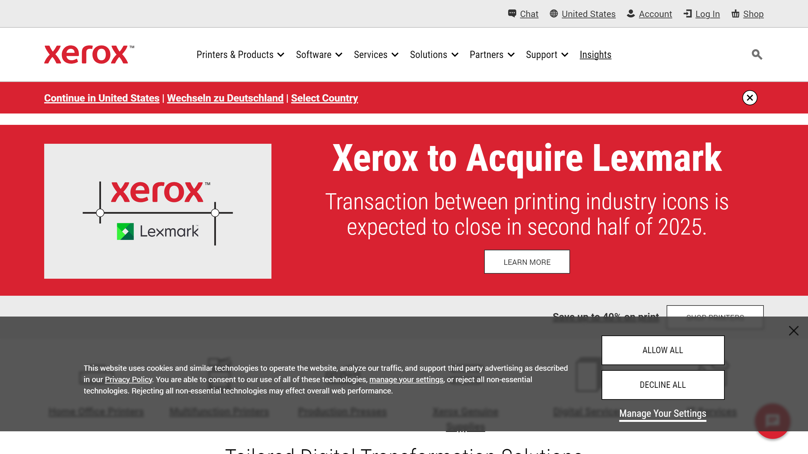

# Xerox

Xerox Corporation is a global technology company known for document management solutions, office equipment, and intelligent document processing services that help organizations digitize and automate document workflows.

## Overview

Xerox has evolved from its origins as a pioneer in photocopying technology to become a comprehensive provider of document management and intelligent workflow solutions. The company offers a wide range of hardware, software, and services designed to help organizations capture, process, and manage documents more efficiently.

Xerox's document processing capabilities combine traditional strengths in document capture with advanced technologies in artificial intelligence and machine learning. Their solutions address the entire document lifecycle, from initial capture through processing, distribution, storage, and retrieval.

As a long-established player in the document technology space, Xerox brings decades of experience in understanding document workflows across industries. Their intelligent document processing solutions are designed to integrate with their broader ecosystem of print and digital document services, providing comprehensive approaches to document management challenges.

## Key Features

- **Document Capture Solutions**: Advanced scanning hardware and software for document digitization
- **Intelligent Recognition**: OCR and intelligent character recognition technologies
- **Automated Classification**: AI-powered document categorization and routing
- **Data Extraction**: Automated extraction of structured data from documents
- **Workflow Automation**: End-to-end processing of document-centric workflows
- **Content Management**: Systems for organizing and retrieving digital documents
- **Output Management**: Distribution of processed documents to multiple channels
- **Mobile Solutions**: Document capture and processing via mobile devices
- **Integration Capabilities**: Connections with enterprise business systems
- **Analytics and Reporting**: Insights into document processing metrics and performance

## Use Cases

### Enterprise Document Management

Organizations implement Xerox solutions to create comprehensive document management ecosystems. The approach begins with high-volume document capture using Xerox scanning hardware and software, followed by intelligent processing that automatically classifies documents, extracts key data, and routes information to appropriate workflows. Content management systems organize the digitized documents while maintaining security and compliance controls. Workflow automation handles approvals and exceptions while integration with business systems ensures data consistency across the enterprise. This end-to-end approach reduces document handling costs, improves information accessibility, strengthens compliance capabilities, and accelerates document-dependent processes.

### Accounts Payable Automation

Finance departments utilize Xerox's intelligent document processing to streamline accounts payable operations. The solution captures incoming invoices through multiple channels, automatically extracts header and line-item details, validates the information against purchase orders and receiving documents, and routes for appropriate approvals. Integration with ERP and accounting systems enables straight-through processing for matched invoices while exception handling workflows manage discrepancies efficiently. The implementation provides visibility into invoice status, captures early payment discounts, reduces processing costs significantly, and improves supplier relationships through more consistent payment processes.

## Technical Specifications

| Feature | Specification |
|---------|---------------|
| Capture Hardware | High-volume scanners, MFPs, mobile capture |
| Software Solutions | DocuShare, Workflow Automation Solutions |
| Deployment Options | Cloud, On-premises, Hybrid |
| Processing Capabilities | Millions of pages per day (enterprise scale) |
| Recognition Technology | Advanced OCR with contextual understanding |
| Integration Methods | APIs, Connectors, Custom Integration Services |
| Security Features | Enterprise-grade encryption, access controls, compliance features |
| Supported Formats | All standard document formats (PDF, Office, images) |
| AI Technologies | Machine learning, pattern recognition, natural language processing |
| Implementation Services | Professional services for custom solutions |

## Getting Started

1. **Assessment**: Evaluation of current document workflows and pain points
2. **Solution Design**: Customized design of hardware, software and workflow components
3. **Implementation**: Professional deployment of integrated solution
4. **Training**: User and administrator training programs
5. **Ongoing Support**: Maintenance and continuous improvement services

## Resources

- [Company Website](https://www.xerox.com/)
- [Document Management Solutions](https://www.xerox.com/en-us/services/enterprise-content-management)
- [Workflow Automation](https://www.xerox.com/en-us/services/workflow-automation)

