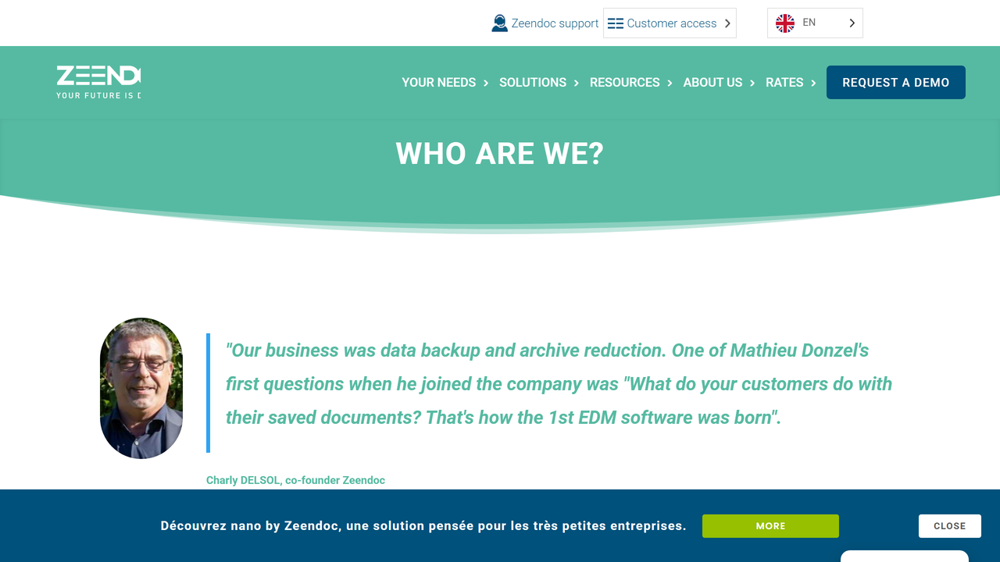

# Zeendoc

Zeendoc is a French cloud-based document management solution provider specializing in business document digitization, organization, and workflow automation for small and medium enterprises.

## Overview

Zeendoc, founded in 2007 by Charly Delsol and Mathieu Donzel in Ajaccio, Corsica, develops electronic document management systems (EDMS) enabling organizations to store, classify, retrieve, and share business documents through cloud infrastructure. The company serves 500,000 users across 11,000+ organizations with over 200 employees, more than half dedicated to research and development. Zeendoc's data centers in France operate on green energy, emphasizing environmental sustainability.

The platform combines document capture, intelligent classification, secure storage, and workflow automation in a web-based interface. Zeendoc serves sectors with intensive document processing including accounting, legal, healthcare, and general business administration across European markets, with particular strength in French-speaking regions.

## Key Features

- **[Document Digitization](../../capabilities/ocr/index.md)**: Scanning and digital capture with multi-channel intake
- **[Intelligent Classification](../../capabilities/classification/index.md)**: Automated document indexing and organization
- **[OCR Technology](../../capabilities/ocr/index.md)**: Multilingual text recognition for searchable documents
- **Secure Cloud Storage**: Encrypted document repository hosted in French data centers
- **Workflow Automation**: Customizable document process automation and approval routing
- **Access Control**: Role-based permissions and security for sensitive documents
- **Mobile Access**: iOS and Android applications for document capture and retrieval
- **Document Sharing**: Secure internal and external collaboration capabilities
- **Advanced Search**: Full-text and metadata-based document retrieval
- **Audit Trail**: Comprehensive document history and activity tracking
- **Electronic Signatures**: Integrated signing capabilities for document execution
- **Retention Policies**: Automated lifecycle management for regulatory compliance

## Use Cases

### Accounting Document Management

Accounting firms digitize financial documents by capturing invoices, receipts, and bank statements through scanner integration, email import, and mobile capture. Zeendoc's OCR extracts invoice numbers, dates, and amounts while automated workflows route documents for approval based on spending thresholds. Integration with accounting software synchronizes financial data and documentation, accelerating processing and maintaining compliance through audit trails.

### Legal Document Management

Law firms organize case files and legal documentation in centralized repositories with custom metadata for practice areas. Advanced security including encryption, access controls, and audit logs protects client information. Full-text search enables attorneys to locate specific language across document collections, while version control tracks revisions and maintains change history.

### Human Resources Document Management

HR departments maintain secure digital employee files containing contracts, certifications, and performance reviews. Document templates and electronic signatures facilitate HR document creation and completion. Automated workflows manage onboarding, reviews, and leave requests, while retention policies enforce lifecycle management according to employment law, integrating with HRIS systems for synchronized data.

## Technical Specifications

| Feature | Specification |
|---------|---------------|
| Deployment Model | 100% Cloud-based SaaS |
| Device Compatibility | PC, Mac, Linux, smartphones, tablets |
| Browser Support | All major web browsers |
| OCR Capabilities | Multilingual text recognition |
| Security | Encryption, role-based access, audit trails, ISO 27001 certified |
| Data Hosting | France (green energy data centers) |
| Storage Capacity | Unlimited document storage |
| Integrations | Accounting software, HRIS systems, Office 365, Google Workspace |
| Mobile Apps | iOS and Android native applications |
| Compliance | GDPR, French data protection regulations |
| User Interface | French and English languages |

## Getting Started

1. **Account Setup**: Register for Zeendoc account with subscription selection
2. **Configuration**: Set up document categories, metadata fields, and workflows
3. **User Management**: Create accounts with role-based permissions
4. **Document Migration**: Import existing documents and establish organization
5. **Training**: User education on document capture, search, and workflow participation

## Resources

- [Website](https://www.zeendoc.com/)
- [English Information](https://www.zeendoc.com/en/)
- [About Us](https://www.zeendoc.com/en/qui-sommes-nous/)

## Company Information

Headquarters: Ajaccio, Corsica, France

Founded: 2007 (company originated in 2000 as SAGES Informatique)

Founders: Charly Delsol, Mathieu Donzel

Employees: 200+ (50%+ in R&D)

Users: 500,000

Organizations: 11,000+

Data Centers: France (green energy powered)

Target Market: Small and medium enterprises (SMEs)

Industries: Accounting, legal, healthcare, professional services, general business

Languages: French, English

Environmental Focus: Green energy data centers, paperless document management
